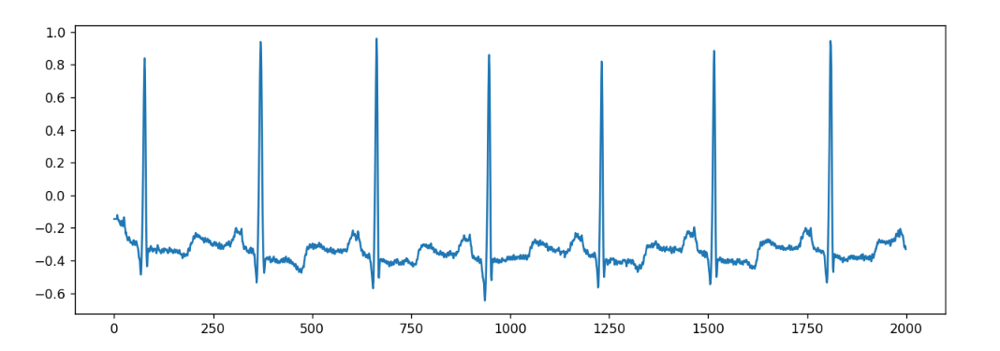
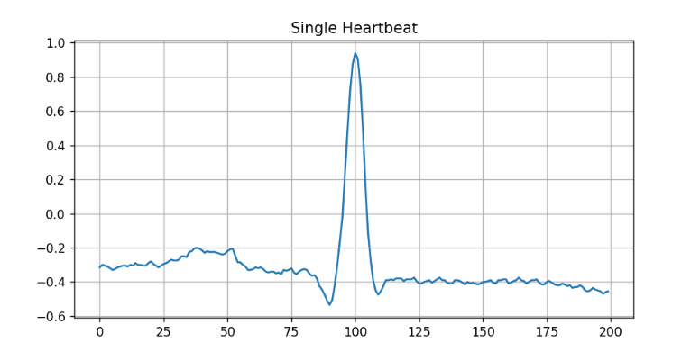
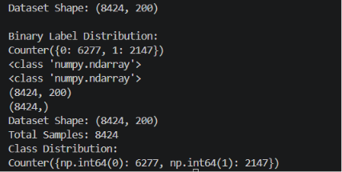
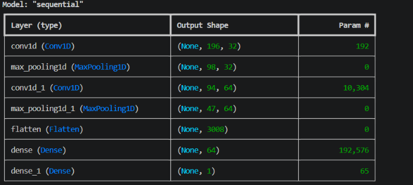
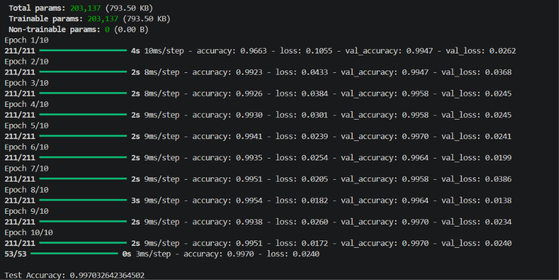
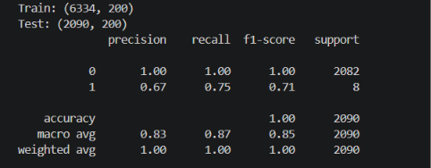
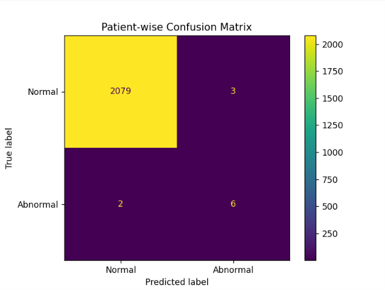

# 🫀 ECG Arrhythmia Detection using Deep Learning

## Overview

This project implements an end-to-end ECG Arrhythmia Detection system using the MIT-BIH Arrhythmia Database. The pipeline processes raw ECG recordings, extracts individual heartbeats, generates binary labels (Normal vs Abnormal), and trains both Machine Learning and Deep Learning models for classification.

The goal of this project was to gain hands-on experience in healthcare AI, signal processing, machine learning, and deep learning using real-world medical data.

---

## Dataset

**MIT-BIH Arrhythmia Database**

Records Used:

* 100
* 101
* 102
* 103

Dataset Statistics:

* Total Heartbeats: 8,424
* Normal Beats: 6,277
* Abnormal Beats: 2,147
* Heartbeat Length: 200 Samples

---

## Raw ECG Signal

Raw ECG waveform from the MIT-BIH Arrhythmia Database.

---

## Heartbeat Extraction

Individual heartbeat extracted using annotation peak locations. Each heartbeat is represented as a 200-sample ECG segment.

---

## Dataset Statistics

After preprocessing and heartbeat extraction, a dataset of 8,424 labeled heartbeats was created for model training and evaluation.

---

## CNN Architecture

The deep learning model consists of:

* Conv1D (32 filters)
* MaxPooling1D
* Conv1D (64 filters)
* MaxPooling1D
* Flatten
* Dense (64 neurons)
* Dense (1 neuron, Sigmoid activation)

Total Trainable Parameters: **203,137**

---

## Model Training Results

Training Configuration:

* Optimizer: Adam
* Loss Function: Binary Crossentropy
* Epochs: 10
* Batch Size: 32

### Performance

* Test Accuracy: **99.70%**

---

## Patient-wise Evaluation

To evaluate model generalization, a patient-wise experiment was performed.

Training Records:

* 100
* 101
* 102

Testing Record:

* 103

This evaluation simulates a real-world scenario where the model encounters ECG signals from an unseen patient.

---

## Confusion Matrix

Patient-wise Results:

| Metric                       | Value |
| ---------------------------- | ----- |
| Correct Normal Predictions   | 2079  |
| False Positives              | 3     |
| Correct Abnormal Predictions | 6     |
| False Negatives              | 2     |

The model successfully detected most abnormal beats while maintaining excellent performance on normal heartbeats.

---

## Technologies Used

* Python
* NumPy
* TensorFlow / Keras
* Scikit-Learn
* WFDB
* Matplotlib
* Git & GitHub

---

## Project Structure

ECG-Arrhythmia-Detection

├── data/

├── images/

├── dataset_loader.py

├── cnn_model.py

├── patient_split.py

├── requirements.txt

├── README.md

└── .gitignore

---

## Key Learnings

Through this project, I gained practical experience in:

* ECG Signal Processing
* Heartbeat Extraction
* Medical Data Analysis
* Machine Learning
* Deep Learning with CNNs
* Model Evaluation
* Git and GitHub Workflow

---

## Future Improvements

* Multi-class Arrhythmia Classification
* Additional MIT-BIH Records
* ROC Curve Analysis
* Real-time ECG Monitoring
* Streamlit-based Web Application

---

## Author

**Karthik Sajan**

Computer Science & Data Science Student

Exploring Machine Learning, Deep Learning, Healthcare AI, and Data Science.
